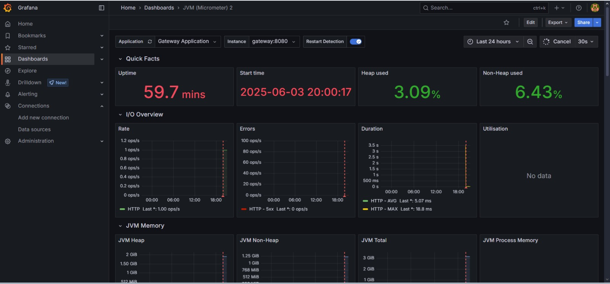

# Observabilidade com Grafana e Prometheus

Este projeto utiliza **Prometheus** e **Grafana** para monitoramento e observabilidade dos microsserviços implantados com Kubernetes.

---

## Visão Geral

A observabilidade da aplicação foi estruturada com os seguintes objetivos:

- Coletar métricas de saúde e desempenho dos microsserviços.
- Visualizar o comportamento da aplicação em tempo real.
- Identificar gargalos ou falhas rapidamente.

---

## Ferramentas Utilizadas

| Ferramenta  | Função                                                      |
|-------------|-------------------------------------------------------------|
| **Prometheus** | Coleta e armazena métricas expostas pelos serviços via endpoint `/actuator/prometheus` |
| **Grafana**    | Visualiza as métricas coletadas em dashboards personalizáveis |

---

## Coleta de Métricas com Prometheus

Para este projeto, o Prometheus foi configurado para coletar métricas **do microsserviço de Gateway**, pois ele é o responsável por receber e rotear todas as requisições que chegam à aplicação.

Dessa forma, conseguimos observar:

- Quantidade de requisições recebidas
- Latência de resposta
- Erros por endpoint
- Tráfego geral da aplicação

---

### Exposição do endpoint

O microsserviço de Gateway foi configurado com Spring Boot Actuator para expor métricas em:

```
/actuator/prometheus
```

### Arquivo `application.yaml`:

Neste arquivo foram adicionadas as configurações necessárias para expor o endpoint de métricas do Prometheus.
```yaml
management:
  endpoints:
    web:
      exposure:
        include: prometheus
  endpoint:
    prometheus:
      enabled: true
```

### Arquivo `prometheus.yml`:
Neste arquivo foram definidas as configurações de coleta de métricas do Prometheus, incluindo o endpoint do Gateway.
```yaml
scrape_configs:

- job_name: 'GatewayMetrics'
  metrics_path: '/gateway/actuator/prometheus'
  scrape_interval: 1s
  static_configs:
    - targets:
        - gateway:8080
      labels:
        application: 'Gateway Application'
```

---

## Visualização com Grafana

O Grafana foi configurado para se conectar ao Prometheus como fonte de dados principal.

### Dashboard

Um dashboard foi criado no Grafana para monitorar:

- Uso de CPU e memória
- Número de requisições recebidas pelo gateway
- Tempo de resposta por rota
- Status do serviço

### Exemplo de Fonte de Dados (Prometheus):
- URL: `http://prometheus:9090`
- Tipo: Prometheus
- Acesso: proxy

---

## Acesso ao Grafana

O serviço do Grafana foi exposto via NodePort ou LoadBalancer no cluster, tornando possível acessar a interface gráfica via navegador.

### Exemplo:

```
http://localhost:3000
```

> As credenciais padrão de acesso ao Grafana são:
> - Usuário: `admin`
> - Senha: `admin`

---

## Dashboard do Grafana





---

## Tecnologias

- **Prometheus** (coleta de métricas)
- **Grafana** (dashboards de visualização)
- **Spring Boot Actuator** (exposição das métricas)
- **Docker + Kubernetes** para orquestração dos serviços

---
