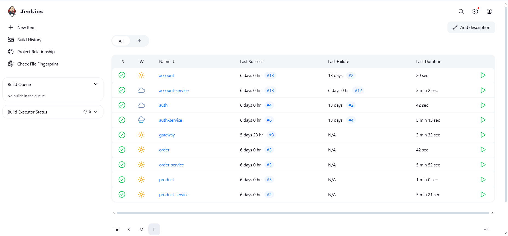

# Integração com Jenkins

Este projeto utiliza o **Jenkins** como ferramenta de integração contínua (CI) para compilar, testar, construir e implantar automaticamente os microsserviços.

---

## Visão Geral da Integração

Cada microsserviço do sistema (Auth, Account, Product, Order e Gateway) possui um arquivo `Jenkinsfile` na raiz do repositório. Esse arquivo define o pipeline automatizado com as seguintes etapas:

- **Build:** Compilação do projeto com Maven.
- **Testes (opcional):** Execução de testes unitários (se aplicável).
- **Build da Imagem Docker:** Construção de uma imagem do serviço.
- **Push da Imagem:** Envio da imagem para um repositório Docker (Docker Hub, GitHub Packages etc.).
- **Deploy:** Implantação em um cluster Kubernetes ou outro ambiente configurado.

---

## Organização no Jenkins

No Jenkins, os pipelines foram organizados por microsserviço. Cada repositório possui um job que é disparado automaticamente via **webhook do GitHub** sempre que há um *push* para o branch `main`.

- Exemplo de pipelines:
  - `auth-service`
  - `account-service`
  - `product-service`
  - `order-service`
  - `gateway`

---

## Exemplo de Dashboard

Abaixo está uma captura de tela da interface do Jenkins, mostrando o status dos pipelines dos microsserviços após execução automática.




---

## Jenkinsfile - Exemplo

Os arquivos `Jenkinsfile` seguem o padrão abaixo, adaptado para cada microsserviço. Aqui está um exemplo para o serviço de produtos:

```groovy
pipeline {
    agent any
    environment {
        SERVICE = 'product-service'
        NAME = "rafaelaafferri/${env.SERVICE}"
    }
    stages {
        stage('Dependecies') {
            steps {
                build job: 'product', wait: true
            }
        }
        stage('Build') { 
            steps {
                sh 'mvn -B -DskipTests clean package'
            }
        }      
        stage('Build & Push Image') {
            steps {
                withCredentials([usernamePassword(credentialsId: 'dockerhub-credential', usernameVariable: 'USERNAME', passwordVariable: 'TOKEN')]) {
                    sh "docker login -u $USERNAME -p $TOKEN"
                    sh "docker buildx create --use --platform=linux/arm64,linux/amd64 --node multi-platform-builder-${env.SERVICE} --name multi-platform-builder-${env.SERVICE}"
                    sh "docker buildx build --platform=linux/arm64,linux/amd64 --push --tag ${env.NAME}:latest --tag ${env.NAME}:${env.BUILD_ID} -f Dockerfile ."
                    sh "docker buildx rm --force multi-platform-builder-${env.SERVICE}"
                }
            }
        }
        stage('Deploy') { 
            steps {
                sh 'kubectl apply -f k8s/k8s.yaml'
            }
        }
    }
}
```
