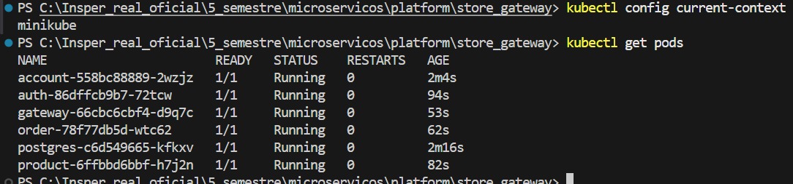
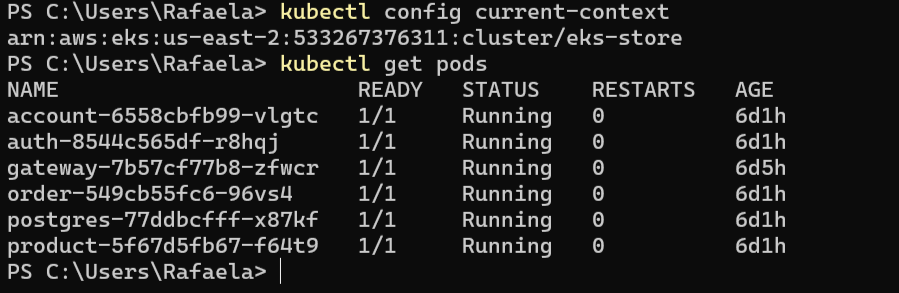

# Implantação com Kubernetes

Este projeto foi implantado usando **Kubernetes** tanto em ambiente local com o **Minikube** quanto em ambiente na **AWS**, utilizando um cluster gerenciado pelo **Amazon EKS**.

---

## Visão Geral

A aplicação foi containerizada com Docker e orquestrada com Kubernetes, permitindo:

- Escalabilidade horizontal dos microsserviços.
- Isolamento entre componentes (Auth, Product, Order, Account, Gateway).
- Facilidade de deploy com arquivos YAML versionados.
- Transição suave entre ambiente local e nuvem.

---

## Estrutura dos Arquivos Kubernetes

Cada microsserviço possui uma pasta chamada `k8s/`, que contém os arquivos de configuração YAML utilizados para definir os deployments e os serviços no cluster.

Esses arquivos estão localizados diretamente nos repositórios dos microsserviços:

- `store-auth-service/k8s/`
- `store-account-service/k8s/`
- `store-product-service/k8s/`
- `order-service/k8s/`
- `store-gateway/k8s/`

Os arquivos k8s.yaml incluem:

- Deployment: define os pods, containers, replicas, ports e variáveis de ambiente.
- Service: define os serviços (tipo `ClusterIP` ou `LoadBalancer`) para expor os pods internamente ou externamente.

---

## Deploy Local com Minikube

Para testar localmente, utilizei o **Minikube**, que permite rodar um cluster Kubernetes no computador pessoal.

### Comandos utilizados:

```bash
minikube start
kubectl apply -f k8s/
```

Após esses comandos, os serviços ficaram acessíveis através dos IPs expostos pelo `minikube tunnel`.

---

## Deploy em Ambiente AWS (EKS)

Na nuvem, a aplicação foi implantada no **Amazon Elastic Kubernetes Service (EKS)**, um serviço gerenciado da AWS para clusters Kubernetes.

### Passos principais:

1. Criação do cluster com `eksctl`:
```bash
eksctl create cluster --name store-cluster --region us-east-1 --nodes 2
```

2. Configuração do `kubectl` com a AWS:
```bash
aws eks --region us-east-1 update-kubeconfig --name store-cluster
```

3. Aplicação dos arquivos YAML:
```bash
kubectl apply -f k8s/
```

4. Exposição dos serviços principais via **LoadBalancer**, especialmente o Gateway:
```yaml
apiVersion: v1
kind: Service
metadata:
  name: gateway
spec:
  type: LoadBalancer
  ports:
    - port: 80
      targetPort: 8080
```

---

## Monitoramento e Testes

Para acompanhar os pods e serviços:

```bash
kubectl get pods
kubectl get services
kubectl describe pod <nome-do-pod>
```

---

## Kubernetes em Ação

**Localmente:**


**Na AWS:**


## Tecnologias Utilizadas

- **Kubernetes**
- **Minikube**
- **Amazon EKS**
- **kubectl**
- **eksctl**
- **Docker**
- **YAML**
